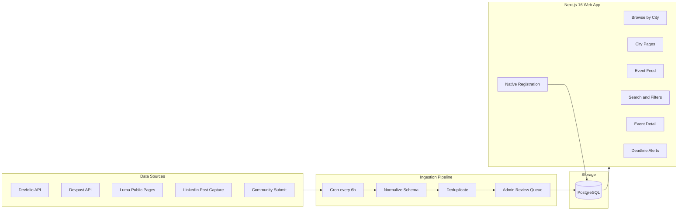
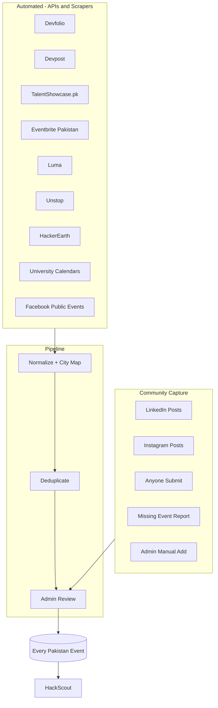
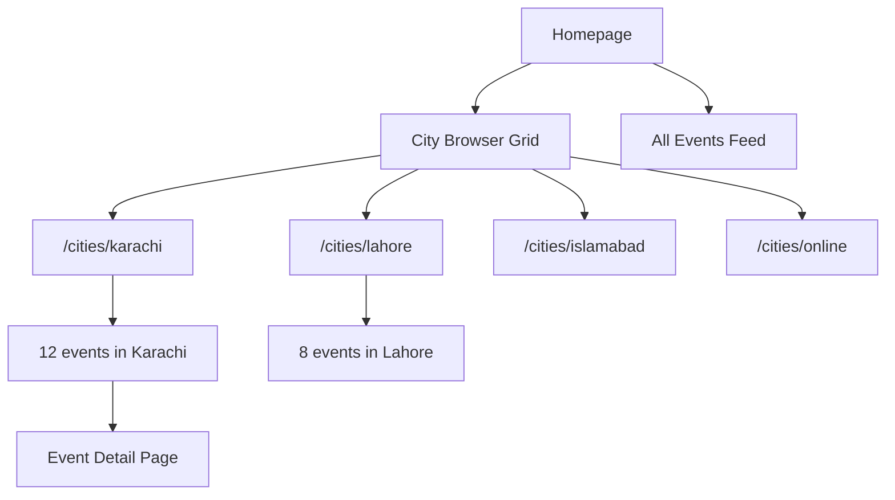

# HackScout — Centralized Event Aggregation Platform

## Recommended Project Name

**Top pick: HackScout** — short, memorable, and describes exactly what the product does (scouting hackathons/events before deadlines pass). Works well for branding: *"Where do you find hackathons? HackScout."*

| Name | Vibe | Why it works |
|------|------|--------------|
| **HackScout** (recommended) | Action-oriented, dev-friendly | Directly answers "where do you find hackathons?" — your LinkedIn DM problem |
| **DeadlineRadar** | Urgency-focused | Highlights the core pain: never miss a registration deadline again |
| **EventPulse** | Modern, feed-like | Implies a living stream of what's happening right now |
| **ScoutPK** | Pakistan-specific | Short, local identity, good for `.pk` domain |
| **HackFlow** | Smooth, minimal | Discovery feels effortless — browse, register, done |

Final name can be decided before scaffold; repo folder can stay `Event-Finder` or rename to `hackscout`.

## The Problem (Validated)

Your LinkedIn DMs confirm the gap: students discover events through scattered feeds (LinkedIn activity, Luma with sparse listings) and often miss deadlines. Critically, **many events are announced only as LinkedIn posts** — they never appear on Devfolio, Devpost, or Luma. There is **no single place that shows every event happening in Pakistan** — hackathons in Karachi, conferences in Islamabad, workshops in Lahore, university competitions in Peshawar, startup meetups in Faisalabad — all scattered and easy to miss.

## Product Vision

**HackScout** = **Pakistan ka poora event hub** — every event happening anywhere in Pakistan, in every city, of every type. Browse by city, see what's happening near you, and never miss a registration deadline. If it's happening in Pakistan, it should be on HackScout.



---

## Tech Stack

| Layer | Choice | Why |
|-------|--------|-----|
| Framework | **Next.js 16.3** (App Router) + TypeScript | Latest stable (Aug 2026): Turbopack default, Cache Components (`"use cache"`), Instant Navigations, React 19.2, `proxy.ts` |
| UI | **Tailwind CSS** + **shadcn/ui** | Clean, mobile-responsive feed UI |
| AI extraction | **OpenAI / Vercel AI SDK** | Parse LinkedIn post text into structured event fields |
| Database | **PostgreSQL** via **Supabase** | Relational event data, built-in auth, free tier |
| ORM | **Prisma** | Type-safe schema, migrations |
| Job queue | **BullMQ** + **Redis** (Upstash) | Scheduled scraper runs every 6 hours |
| Email | **Resend** | Deadline reminder emails |
| Deploy | **Vercel** (app) + **Railway/Render** (worker) | Simple, low-cost |

---

## Pakistan-Wide Coverage (North Star)

**Rule: Pakistan ka har event HackScout par hona chahiye — chahe jahan se marzi nikalo.** Devfolio ho, LinkedIn ho, Facebook ho, university website ho, Eventbrite ho — koi bhi source, koi bhi city, koi bhi type. Agar Pakistan mein ho raha hai, yahan dikhega.

### What "all events" means
The platform covers **every event type**, not just hackathons:

| Category | Examples |
|----------|----------|
| Hackathon | GDSC hackathons, Devfolio/Devpost competitions |
| Conference | Tech summits, industry conferences, TEDx |
| Workshop | Coding bootcamps, design sprints, AI workshops |
| Meetup | Startup meetups, developer communities, GDG events |
| Competition | Case competitions, pitching contests, olympiads |
| Seminar / Webinar | University seminars, career talks, online webinars |
| Career Fair | Job fairs, internship drives, recruitment events |
| Festival | Tech festivals, innovation weeks, expo events |

### Geographic scope
- **All cities in Pakistan** — not just Karachi, Lahore, Islamabad. Every city with events gets a page: Multan, Peshawar, Quetta, Hyderabad, Sialkot, Gujranwala, Abbottabad, Bahawalpur, Sargodha, Sukkur, Mardan, and more
- **Smaller cities** supported via free-text city input on submit form; admin adds new cities to the directory as they appear
- **Online events** open to Pakistan participants included under `/cities/online`
- **Default homepage = all Pakistan events** — no filter hiding events; city browser is for narrowing down, not restricting

### Coverage strategy — jahan se marzi nikalo



**Philosophy: source doesn't matter, coverage does.** We pull from every platform that has Pakistan events — automated where possible, community-powered where not.

1. **Automated scrapers** — run every 6 hours across ALL sources below
2. **LinkedIn + Instagram capture** — paste post → AI extracts → live in minutes
3. **Open submission** — koi bhi 30 sec mein event add kare
4. **"Missing an event?"** — har page par, agar kuch nahi hai to report karo
5. **Admin manual add** — aap khud events add karo jo kisi scraper se nahi mile
6. **Your LinkedIn curation** — jo events aap already share karti ho, woh seed content

### Homepage messaging
- Hero: **"Har event, har shehar — Pakistan ka event hub"** (Every event, every city)
- Live counter: **"247 events across 18 cities in Pakistan"**
- No paywall, no login wall — browse everything freely

---

## City-First Architecture (Core Design Principle)

Every event **must** have a city. This is not optional metadata — it's how users navigate the platform.

### City coverage
- **Complete Pakistan city directory** seeded at launch — all provincial capitals + major cities + growing list as community submits from smaller towns
- Cities include: Karachi, Lahore, Islamabad, Rawalpindi, Faisalabad, Multan, Peshawar, Quetta, Hyderabad, Sialkot, Gujranwala, Abbottabad, Bahawalpur, Sargodha, Sukkur, Mardan, Mirpur, Gilgit, and more
- **"Other city"** free-text field on submit form for cities not yet in the directory — admin promotes to full city page once 3+ events exist
- **Online / Virtual** treated as a first-class "city" for remote events open to everyone
- Scrapers and AI extraction **required** to assign a city; admin review catches missing/ambiguous locations
- Community submit form has a **required city dropdown** (searchable) + "Online" option

### City normalization
Raw location strings from sources get mapped to canonical cities:
- `"KHI"`, `"Karachi, Sindh"`, `"karachi pakistan"` → `Karachi`
- `"LHE"`, `"Lahore Punjab"` → `Lahore`
- `"Virtual"`, `"Remote"`, `"Online"` → `Online`
- Unknown city strings flagged in admin queue for manual assignment

### How users browse by city



**Homepage layout:**
1. **"Browse by City"** — grid of city cards showing event count + "X closing this week"
2. **"Near You"** — auto-detect city via browser geolocation (optional, with manual override)
3. **"All Events in Pakistan"** — full nationwide feed below city grid; shows every event regardless of city, sorted by deadline

**City pages (`/cities/[slug]`):**
- Header: "Events in Karachi" with live count
- Sub-filters: category, deadline window, online/in-person within that city
- Sorted by registration deadline ascending
- SEO-optimized: "Hackathons in Karachi 2026" — drives organic search per city

**Event cards always show city:**
```
┌─────────────────────────────────┐
│  [Cover Image]                  │
│  📍 Karachi  ·  Hackathon       │
│  AI Summit Hackathon 2026       │
│  ⏰ Closes in 3 days            │
│  Mar 15–17  ·  Prize: $5,000   │
└─────────────────────────────────┘
```

---

## Data Sources — Pull From Everywhere

**Pakistan ka har event, har source se.** Neeche saari jagahon se data nikalega — koi source skip nahi.

### Automated sources (scrapers run every 6 hours)

| # | Source | Kya milega | Method | Priority |
|---|--------|-----------|--------|----------|
| 1 | **Devfolio** | South Asia hackathons | Public API | High |
| 2 | **TalentShowcase.pk** | Pakistan-only hackathons, competitions | Web scrape | High |
| 3 | **Eventbrite** | Conferences, workshops, meetups (Pakistan filter) | Public API | High |
| 4 | **Devpost** | Global hackathons (Pakistan filter) | Public API | Medium |
| 5 | **Luma** | Local meetups, small events | Public page scrape | Medium |
| 6 | **Unstop** | Student hackathons, competitions (India + online) | Web scrape | Medium |
| 7 | **HackerEarth** | Corporate + student hackathons | API + scrape | Medium |
| 8 | **Facebook Events** | University events, community meetups | Public page scrape | Medium |
| 9 | **University calendars** | NUST, LUMS, FAST, GIKI, COMSATS, IBA, NED | Per-site scrape | Medium |
| 10 | **GDSC / GDG chapters** | Google developer events per city | Community + scrape | Low |

**Scraper strategy per source:**
- Query with `Pakistan` + every major city name (`Karachi`, `Lahore`, `Islamabad`, `Peshawar`, `Multan`, `Faisalabad`, `Quetta`, `Hyderabad`, etc.)
- Filter: location contains Pakistan OR any Pakistani city OR online-open-to-all
- Unknown cities → admin review queue, not dropped
- Failed scrape → alert + retry; never silently skip

### Community-powered sources (where automation can't reach)

| # | Source | Kya milega | Method |
|---|--------|-----------|--------|
| 11 | **LinkedIn posts** | Sab se zyada Pakistan events — scattered in feeds | Paste URL/text → AI extract |
| 12 | **Instagram posts** | University clubs, event pages announce here | Paste URL/text → AI extract |
| 13 | **WhatsApp forwards** | Events shared in groups (no API) | Manual submit / screenshot → AI |
| 14 | **Anyone submit** | Koi bhi event jo kisi platform par nahi | `/submit` form (30 sec) |
| 15 | **"Missing an event?"** | User reports gap | Quick report form |
| 16 | **Admin manual add** | Aap khud events add karo | Admin panel |

### Source details

#### 1. Devfolio (API)
- `?query=Pakistan` + per-city queries for every major city
- `type=application_open` + `type=upcoming` buckets, filter to Pakistan

#### 2. TalentShowcase.pk (Pakistan-only — high value)
- Scrape [talentshowcase.pk](https://www.talentshowcase.pk) — hackathons, competitions, internships
- Already Pakistan-focused; every listing is relevant

#### 3. Eventbrite (API — conferences, workshops)
- `GET /v3/events/search/?location.address=Pakistan`
- Per-city searches: Karachi, Lahore, Islamabad, etc.
- Covers conferences, workshops, career fairs that hackathon platforms miss

#### 4. Devpost (API — supplementary)
- Fetch upcoming, filter Pakistan/online-relevant
- International platform — only keep Pakistan-applicable events

#### 5. Luma (scrape)
- Public `lu.ma` pages tagged Pakistan or Pakistani cities

#### 6. Unstop (scrape — India-heavy but useful)
- [unstop.com/hackathons](https://unstop.com/hackathons) — filter online + Pakistan-accessible
- Harder to scrape (WAF) — use Playwright if needed

#### 7. HackerEarth (API + scrape)
- Corporate hackathons, some open to Pakistan participants

#### 8. Facebook Events (scrape public pages)
- University pages: NUST, LUMS, FAST, GIKI, COMSATS, IBA, NED, UET
- Tech community pages per city
- Only public events; no login circumvention

#### 9. University calendars (per-site scrapers)
- Each university has event pages — build scraper per site
- Start with top 5: NUST, LUMS, FAST, GIKI, COMSATS
- Add more universities over time

#### 10. LinkedIn Post Capture (biggest gap filler)

LinkedIn has **no public API for posts**, and automated scraping violates their ToS. Instead, HackScout uses a **community-powered capture pipeline** that turns LinkedIn's scattered announcements into structured events:

**How it works:**

1. **Quick Submit (`/submit/linkedin`)** — optimized 30-second mobile form:
   - Paste a LinkedIn post URL *or* copy-paste the post text
   - Optional: screenshot upload for posts behind login walls
   - AI (Vercel AI SDK) auto-extracts: event title, dates, registration deadline, registration link, **city**, category
   - Submitter reviews/edits extracted fields → submits to moderation queue

2. **"Saw it on LinkedIn?" badge** — events sourced from LinkedIn posts get a distinct badge so users know this is the content they'd otherwise miss in their feed

3. **Your curation workflow** — as someone who already discovers events on LinkedIn, you become the first power submitter. Each event you post about can be added to HackScout in under a minute, and your LinkedIn audience gets a single link instead of scattered posts

4. **Share-back loop** — every event detail page has a "Share on LinkedIn" button with pre-filled text: *"Found this on HackScout — registration closes [date]"*. Turns your LinkedIn presence into a growth channel

5. **Community incentives (Phase 2)** — contributors who submit verified LinkedIn events get a "Scout" badge on their profile

**Why this beats scraping LinkedIn:**
- Legal and sustainable (no ToS violations)
- Captures the exact posts that never reach Devfolio/Luma
- Leverages your existing LinkedIn audience as both submitters and consumers
- AI extraction makes submission friction near-zero

### 5. Community submissions (safety net — kuch bhi miss na ho)
- Standard `/submit` form — **anyone** can add any Pakistan event in 30 seconds
- **"Missing an event?"** CTA on every page — agar scrapers miss karein, community fix kare
- Admin review queue → approved events go live immediately
- **Admin manual add** — aap khud koi bhi event instantly add kar sakti ho

**No source is "deferred" — sab build hoga.** Kuch scrapers Phase 2 mein honge (complexity ke hisaab se), lekin end goal same: **Pakistan ka har event, ek jagah.**

---

## Unified Event Schema

Every ingested event normalizes into one shape:

```typescript
City {
  id, slug, name              // e.g. slug: "karachi", name: "Karachi"
  province?, country           // "Sindh", "Pakistan"
  eventCount                  // denormalized count for city browser cards
  isVirtual: boolean          // true only for the "Online" pseudo-city
}

Event {
  id, slug, title, description, coverImage
  category: hackathon | conference | workshop | meetup | competition | seminar | career_fair | festival | other
  country: string               // always "Pakistan" for domestic events; filter default
  source: devfolio | devpost | talentshowcase | eventbrite | luma | unstop | hackerearth | facebook | university | linkedin | instagram | community | admin
  sourcePostUrl?: string
  sourceUrl: string
  startDate, endDate
  registrationDeadline
  cityId: string              // FK to City — REQUIRED for every event
  city: City                  // joined relation
  venue?: string              // optional venue name, e.g. "NUST SEECS"
  isOnline: boolean           // true if virtual/remote
  tags: string[]
  prizePool?, organizerName
  registrationType: external | native
  registrationUrl?
  status: upcoming | ongoing | closed
  createdAt, updatedAt, lastScrapedAt
}
```

**Deduplication logic:** fuzzy match on `title` + `startDate` within 3 days; merge into one event with multiple `sources[]` badges ("Also on Devfolio").

---

## Core Features (MVP)

### 1. Homepage — All Pakistan Events
- **Hero**: live count — "X events across Y cities in Pakistan"
- **City grid**: browse by city, but default feed below shows **all Pakistan events**
- **"All Events in Pakistan"** nationwide feed, sorted by registration deadline
- Every event card shows **city badge** (`📍 Multan`) + **category badge** (`Workshop`)
- Filters: city, category (all types), online/in-person, deadline window
- **"Missing an event? Add it"** prominent CTA
- Search across all events nationwide

### 2. City Pages (`/cities/karachi`, `/cities/lahore`, ...)
- Dedicated page per city: "Events in Karachi" with live event count
- Deadline-sorted event list for that city only
- Sub-filters: category, deadline window, in-person vs online
- Empty state: "No events in [city] yet — submit one or check Online events"
- SEO title: "All Events in Karachi, Pakistan | HackScout"

### 3. Event Detail Page
- Full description, dates, **city + venue** (linked to city page), organizer info
- Prominent countdown to registration deadline
- Registration CTA (native form OR tracked external link)
- "Save event" button (requires login)
- Share button (WhatsApp, LinkedIn — key for Pakistan audience growth)

### 3. Native Registration (your key differentiator)
Two-tier approach:

**Tier A — Platform-hosted events** (community submissions, organizer portal):
- Organizer defines form fields: name, email, university, team name, GitHub, custom questions
- User fills form on Event-Finder; data stored in DB; organizer gets CSV export + email notification
- No Google Form copying

**Tier B — Aggregated external events** (Devfolio/Devpost):
- "Register on Devfolio" button with click tracking
- Future: organizer can claim listing and switch to native registration

### 4. Deadline Alerts
- User signs up (email or Google OAuth via Supabase Auth)
- Saves events → gets email 3 days and 1 day before registration closes
- **City-based digest**: "3 new hackathons this week in Lahore" (user picks preferred cities)

### 5. Admin Panel (`/admin`)
- Review queue for community submissions
- Approve/reject/edit scraped events
- Trigger manual re-scrape
- View registration submissions per event

### 6. Report Missing Event
- Floating **"Missing an event?"** button on every page
- Quick form: event name, city, link or description → admin review
- Closes the loop: if something's not listed, users can fix it in 30 seconds

### 7. Submit Event (`/submit` + `/submit/linkedin`)
- **Required city field**: searchable dropdown of all Pakistan cities + "Online"
- General submit: title, dates, deadline, description, category, city, venue, registration type
- LinkedIn quick-submit: paste post URL/text → AI extracts fields (including city) → review → submit

---

## Project Structure

```
hackscout/
├── prisma/
│   └── schema.prisma          # Event, City, User, Registration models
├── src/
│   ├── app/
│   │   ├── page.tsx           # Homepage with city browser + event feed
│   │   ├── cities/
│   │   │   ├── page.tsx       # All cities index
│   │   │   └── [slug]/        # Per-city event listing
│   │   ├── events/[slug]/     # Detail page
│   │   ├── submit/            # Community submission
│   │   ├── submit/linkedin/   # LinkedIn post quick-capture
│   │   ├── admin/             # Moderation panel
│   │   ├── saved/             # User's saved events
│   │   └── api/
│   │   ├── events/            # CRUD + search + filter by city
│   │       ├── register/      # Native registration submit
│   │       └── webhooks/      # Scraper callbacks
│   ├── components/
│   │   ├── CityBrowser.tsx    # City grid with event counts
│   │   ├── CityCard.tsx       # Single city card
│   │   ├── CityBadge.tsx      # "📍 Karachi" on event cards
│   │   ├── EventCard.tsx
│   │   ├── DeadlineBadge.tsx
│   │   ├── EventFilters.tsx
│   │   ├── RegistrationForm.tsx
│   │   └── CountdownTimer.tsx
│   ├── lib/
│   │   ├── db.ts
│   │   ├── dedup.ts
│   │   ├── cities.ts          # City seed data + normalization map
│   │   └── email.ts
│   ├── scrapers/
│   │   ├── devfolio.ts
│   │   ├── devpost.ts
│   │   ├── talentshowcase.ts
│   │   ├── eventbrite.ts
│   │   ├── luma.ts
│   │   ├── unstop.ts
│   │   ├── hackerearth.ts
│   │   ├── facebook.ts
│   │   ├── universities/      # NUST, LUMS, FAST, GIKI, COMSATS...
│   │   ├── normalizer.ts
│   │   └── run-all.ts         # Runs ALL scrapers every 6h
│   └── ai/
│       └── extract-event.ts   # LinkedIn post → structured event (AI)
├── worker/
│   └── index.ts               # BullMQ worker (runs scrapers on schedule)
├── package.json
├── .env.example
└── README.md
```

---

## Implementation Phases

### Phase 1 — Foundation (Days 1–3)
- Init Next.js 16.3 (`create-next-app@latest`) + Prisma + Supabase + Tailwind + shadcn/ui
- Enable Turbopack (default), Cache Components for event feed ISR
- Define Prisma schema (Event, **City**, User, SavedEvent, Registration, ScrapeLog)
- Seed all Pakistan cities + "Online" pseudo-city
- Build homepage with city browser grid + mock event data per city
- Deploy skeleton to Vercel

### Phase 2 — Aggregation Pipeline (Days 4–10)
- Implement scrapers for **all automated sources**: Devfolio, TalentShowcase, Eventbrite, Devpost, Luma
- City normalizer + deduplication across all sources
- BullMQ worker runs **all scrapers** every 6 hours
- Wire real data into city pages and nationwide feed

### Phase 2b — More Sources (Days 11–14)
- Add Unstop, HackerEarth, Facebook public events scrapers
- University calendar scrapers (NUST, LUMS, FAST, GIKI, COMSATS)
- Each new source = more Pakistan events on the platform

### Phase 3 — City Pages + Event Detail (Days 15–17)
- Per-city pages (`/cities/[slug]`) with event counts and filters
- Event detail page with city link, venue, countdown timer
- City badge on all event cards
- Search, category/deadline filters scoped to city or global
- External registration link with click tracking
- Luma scraper included in Phase 2; Facebook + universities in Phase 2b

### Phase 4 — Auth + Registration (Days 18–21)
- Supabase Auth (Google + email)
- Save events feature
- Native registration form builder for `/submit`
- Registration data storage + organizer export

### Phase 5 — LinkedIn/Instagram Capture + Admin (Days 22–25)
- LinkedIn quick-submit page with AI event extraction
- "Saw it on LinkedIn?" source badge on event cards
- Admin moderation panel (review LinkedIn-sourced + scraped + community events)
- Email deadline reminders (Resend) + weekly digest

### Phase 6 — Polish + Launch (Days 26–28)
- SEO meta tags per city page ("Hackathons in Lahore 2026")
- Open Graph for LinkedIn sharing with city context
- Mobile responsiveness pass
- Performance (ISR for event pages)
- Seed initial events manually for launch day content
- Share on LinkedIn (your existing audience is the perfect launch channel)

---

## Key UX Decisions

- **City-first navigation** — homepage leads with city browser, not a flat feed
- **Every event has a city** — required field, prominently displayed on cards and detail pages
- **Pakistan-only by default** — platform scope is all events in Pakistan; online/global events included only if open to Pakistan participants
- **Show everything** — no category or city filter applied by default; users narrow down, platform never hides events
- **Default sort = deadline ascending** — solves "I found out too late" directly
- **WhatsApp share** — primary viral channel in Pakistan
- **No login required to browse** — only to save, register natively, or get alerts
- **Source attribution** — always link back to Devfolio/Devpost; builds trust, avoids legal issues

---

## Risks and Mitigations

| Risk | Mitigation |
|------|-----------|
| Scrapers break when sources change APIs | Isolate each scraper; alert on ScrapeLog failures; community submit as fallback |
| Events missing city from scrapers | City normalizer + admin review queue; required city on all submit forms |
| Incomplete coverage — events still missed | 10+ automated sources + LinkedIn/Instagram capture + community submit + admin manual add + "Missing event?" button — multiple safety nets |
| Scraper breaks on one source | Each source isolated; others keep running; community submit fills gap until fixed |
| Smaller cities have few events | Free-text city on submit; promote to city page at 3+ events; show in nationwide feed regardless |
| External registration still required for most events | Native registration for community-submitted events first; "claim your event" for organizers |
| Legal/TOS on scraping | Use public JSON APIs for Devfolio/Devpost; LinkedIn via community submit + AI extraction only (no automated scraping) |
| LinkedIn posts lack structured data | AI extraction from post text; admin review queue catches errors; submitter can edit before publish |

---

## Success Metrics (Post-Launch)

- **Total Pakistan events indexed** (target: comprehensive coverage across all cities)
- Events indexed **per city** with upcoming deadlines
- **% of Pakistan cities with at least 1 active event**
- Community submissions per week (indicator of gap-filling working)
- City page traffic (organic search: "hackathons in Karachi")
- % of events with registration closing within 7 days surfaced at top
- User signups and saved events
- Native registrations completed (vs external redirects)
- Organic traffic from LinkedIn shares
